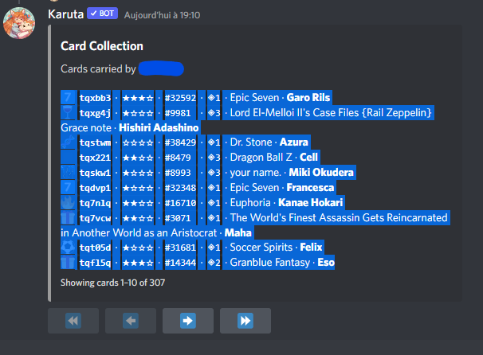

# Karuta Lister Script

This little script takes as input a paste of Karuta's interface when showing cards and gives as output a list of ids.

New features might come soon.

### How to use
You should copy like this, only the lines starting with an emoji.

After this, press enter 2 times (will jump a line, then enter again) script should output a comma-separated list of IDs.

## TODO 
Automatic tag assignment depending on detected anime